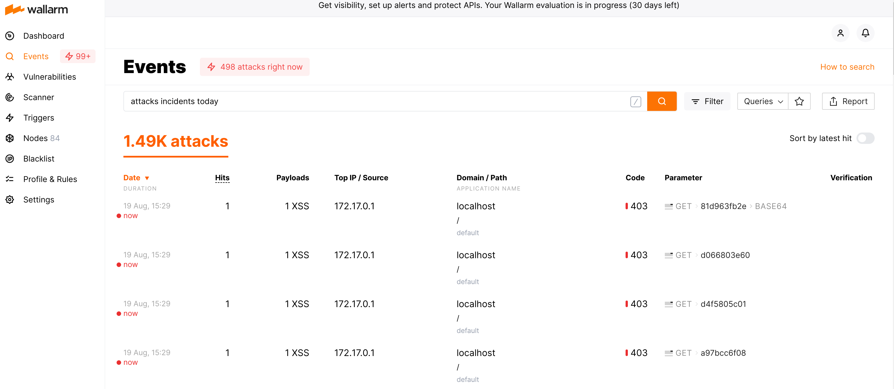

- [Minimal gotestwaf Demo](#minimal-gotestwaf-demo)
- [Create an authentication file](#create-an-authentication-file)
- [Run test app](#run-test-app)
- [Run Wallarm node](#run-wallarm-node)
- [Run gotestwaf](#run-gotestwaf)
- [Wallarm Console](#wallarm-console)
- [Stop demo](#stop-demo)

# Minimal gotestwaf Demo

> In this demo we deploy a web app, a Wallarm node in blocking mode and run gotestwaf against it. 


> Requirements:
> - Docker using the default bridge network
> - Linux

# Create an authentication file

`
vi auth
`


And add the following

```
export WC_DEPLOY_USER="your@email.com" 
export WC_DEPLOY_PASSWORD='your_wallarm_console_pwd'
```

## Source auth file

```
. ./auth
```

# Run demo app and Wallarm node

```
sh demo.sh build
```


# Run gotestwaf
```
sh demo.sh run

Using default tag: latest
latest: Pulling from wallarm/gotestwaf
Digest: sha256:3e9b580ffb51425b2b8f96edc2b4e2ce37446657351b005263da6d756ffb4e17
Status: Image is up to date for wallarm/gotestwaf:latest
docker.io/wallarm/gotestwaf:latest
GOTESTWAF : 2021/08/19 22:22:13.866381 main.go:62: Test cases loading started
GOTESTWAF : 2021/08/19 22:22:13.868756 main.go:69: Test cases loading finished
GOTESTWAF : 2021/08/19 22:22:13.868804 main.go:79: Scanned URL: http://localhost
GOTESTWAF : 2021/08/19 22:22:13.880127 main.go:102: WAF pre-check: OK. Blocking status code: 403
GOTESTWAF : 2021/08/19 22:22:13.881009 main.go:114: WebSocket pre-check. URL to check: ws://localhost
GOTESTWAF : 2021/08/19 22:22:13.883873 main.go:118: WebSocket pre-check: connection is not available, reason: websocket: bad handshake
GOTESTWAF : 2021/08/19 22:22:13.886802 main.go:146: Scanning http://localhost
GOTESTWAF : 2021/08/19 22:22:13.886850 scanner.go:138: Scanning started
GOTESTWAF : 2021/08/19 22:22:16.127291 scanner.go:143: Scanning Time:  2.240405948s
GOTESTWAF : 2021/08/19 22:22:16.127330 scanner.go:174: Scanning finished

Negative Tests:
+-----------------------+-----------------------+-----------------------+-----------------------+-----------------------+-----------------------+
|       TEST SET        |       TEST CASE       |     PERCENTAGE, %     |        BLOCKED        |       BYPASSED        |      UNRESOLVED       |
+-----------------------+-----------------------+-----------------------+-----------------------+-----------------------+-----------------------+
| community             | community-lfi         |                 80.00 |                     4 |                     1 |                     1 |
| community             | community-rce         |                 17.39 |                     4 |                    19 |                    19 |
| community             | community-sqli        |                 76.92 |                    30 |                     9 |                     9 |
| community             | community-xss         |                 89.45 |                   246 |                    29 |                    29 |
| community             | community-xxe         |                100.00 |                     4 |                     0 |                     0 |
| owasp                 | ldap-injection        |                100.00 |                     8 |                     0 |                     0 |
| owasp                 | mail-injection        |                 80.00 |                     8 |                     2 |                     2 |
| owasp                 | nosql-injection       |                100.00 |                    18 |                     0 |                     0 |
| owasp                 | path-traversal        |                100.00 |                    24 |                     0 |                     0 |
| owasp                 | shell-injection       |                100.00 |                     8 |                     0 |                     0 |
| owasp                 | sql-injection         |                100.00 |                    32 |                     0 |                     0 |
| owasp                 | ss-include            |                100.00 |                    20 |                     0 |                     0 |
| owasp                 | sst-injection         |                 88.89 |                    16 |                     2 |                     2 |
| owasp                 | xml-injection         |                100.00 |                    12 |                     0 |                     0 |
| owasp                 | xss-scripting         |                 88.46 |                    23 |                     3 |                     2 |
| owasp-api             | graphql               |                100.00 |                     1 |                     0 |                     0 |
| owasp-api             | rest                  |                100.00 |                     2 |                     0 |                     0 |
| owasp-api             | soap                  |                100.00 |                     2 |                     0 |                     0 |
+-----------------------+-----------------------+-----------------------+-----------------------+-----------------------+-----------------------+
|         DATE:         |       WAF NAME:       |  WAF AVERAGE SCORE:   |  BLOCKED (RESOLVED):  | BYPASSED (RESOLVED):  |      UNRESOLVED:      |
|      2021-08-19       |        GENERIC        |        90.06%         |   462/527 (87.67%)    |    65/527 (12.33%)    |    64/591 (10.83%)    |
+-----------------------+-----------------------+-----------------------+-----------------------+-----------------------+-----------------------+

Positive Tests:
+-----------------------+-----------------------+-----------------------+-----------------------+-----------------------+-----------------------+
|       TEST SET        |       TEST CASE       |     PERCENTAGE, %     |        BLOCKED        |       BYPASSED        |      UNRESOLVED       |
+-----------------------+-----------------------+-----------------------+-----------------------+-----------------------+-----------------------+
| false-pos             | texts                 |                 87.50 |                     1 |                     7 |                     0 |
+-----------------------+-----------------------+-----------------------+-----------------------+-----------------------+-----------------------+
|         DATE:         |       WAF NAME:       |  WAF POSITIVE SCORE:  | FALSE POSITIVE (RES): | TRUE POSITIVE (RES):  |      UNRESOLVED:      |
|      2021-08-19       |        GENERIC        |        87.50%         |     1/8 (12.50%)      |     7/8 (87.50%)      |      0/8 (0.00%)      |
+-----------------------+-----------------------+-----------------------+-----------------------+-----------------------+-----------------------+
****
```
# Wallarm Console



# Delete demo app and Wallarm node

```
sh demo.sh delete
```


> For more information: https://github.com/wallarm/gotestwaf


