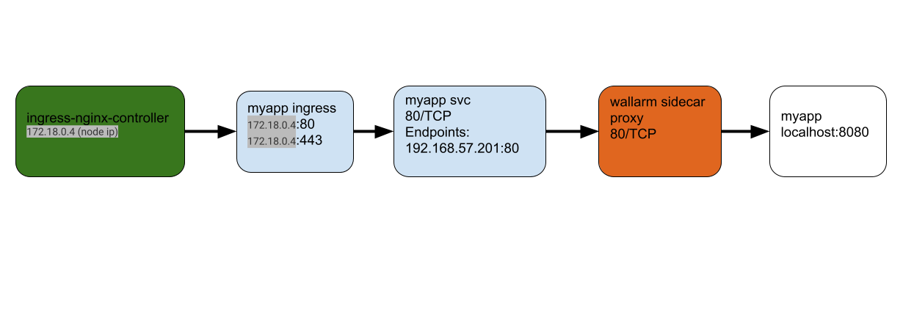

- [Minimal Kubernetes Sidecar Demo](#minimal-kubernetes-sidecar-demo)
- [Wallarm sidecar connectivity diagram](#wallarm-sidecar-connectivity-diagram)
- [Create an authentication file](#create-an-authentication-file)
  - [Source your file](#source-your-file)
- [Deploy Nginx Ingress](#deploy-nginx-ingress)
- [Verify Nginx Ingress components](#verify-nginx-ingress-components)
- [Install myapp using helm](#install-myapp-using-helm)
- [Verify components](#verify-components)
- [Test](#test)
- [Delete](#delete)


# Minimal Kubernetes Sidecar Demo

> During the demo we deploy Wallarm as a sidecar container for myapp application.
> We also deploy nginx ingress to send traffic to myapp application running in the k8s nodes

# Wallarm sidecar connectivity diagram



# Create an authentication file

`vi auth`

And add the following

```
export WC_DEPLOY_USER="your@email.com" 
export WC_DEPLOY_PASSWORD='your_wallarm_console_pwd'
```

## Source your file
. ./auth
# Deploy Nginx Ingress

> The following command will deploy nginx ingress in our K8s cluster

```
kubectl apply -f ingress-nginx.yaml
```

# Verify Nginx Ingress components

```
kubectl get pods -n ingress-nginx -o wide
```
```
NAME                                      READY   STATUS      RESTARTS   AGE   IP               NODE                      NOMINATED NODE   READINESS GATES
ingress-nginx-admission-create-t2dbm      0/1     Completed   0          69m   192.168.57.198   node-5aa745e0.localhost   <none>           <none>
ingress-nginx-admission-patch-w28nw       0/1     Completed   0          69m   192.168.57.199   node-5aa745e0.localhost   <none>           <none>
ingress-nginx-controller-b6b89475-4cbgc   1/1     Running     0          69m   192.168.55.206   node-249068d6.localhost   <none>           <none>
ingress-nginx-controller-b6b89475-5cwhn   1/1     Running     0          69m   192.168.57.200   node-5aa745e0.localhost   <none>           <none>

```

# Install myapp using helm

```
sh run.sh
```

# Verify components
```
kubectl get pods
```
```
NAME                     READY   STATUS    RESTARTS   AGE
myapp-5894b59747-blrxt   2/2     Running   0          66m
```
# Processing Time

kubectl logs myapp-5894b59747-blrxt wallarm-nginx

```
{"http.url":"/?id=or+1=1--a-<script>prompt(1)</script>","http.version":"HTTP/1.1","http.status_code":200,"http.method":"GET","http.referer":"","http.useragent":"curl/7.69.1","time_local":"19/Apr/2022:14:28:26 +0000","remote_addr":"172.18.0.2","remote_user":"","body_bytes_sent":"615","request_time":0.002,"response_content_type":"text/html","X-Forwarded-For":"172.18.0.2, 172.18.0.2","wallarm_request_mono_time":0.000811,"wallarm_request_cpu_time":0.000804}
{"http.url":"/?id=or+1=1--a-<script>prompt(1)</script>","http.version":"HTTP/1.1","http.status_code":200,"http.method":"GET","http.referer":"","http.useragent":"curl/7.69.1","time_local":"19/Apr/2022:14:28:28 +0000","remote_addr":"172.18.0.2","remote_user":"","body_bytes_sent":"615","request_time":0.003,"response_content_type":"text/html","X-Forwarded-For":"172.18.0.2, 172.18.0.2","wallarm_request_mono_time":0.001149,"wallarm_request_cpu_time":0.001127}
{"http.url":"/?id=or+1=1--a-<script>prompt(1)</script>","http.version":"HTTP/1.1","http.status_code":200,"http.method":"GET","http.referer":"","http.useragent":"curl/7.69.1","time_local":"19/Apr/2022:14:28:29 +0000","remote_addr":"172.18.0.2","remote_user":"","body_bytes_sent":"615","request_time":0.002,"response_content_type":"text/html","X-Forwarded-For":"172.18.0.2, 172.18.0.2","wallarm_request_mono_time":0.000570,"wallarm_request_cpu_time":0.000569}
```

> The last 2 metrics `wallarm_request_mono_time` and `wallarm_request_cpu_time` represent Wallarm request processing time measured using CLOCK_MONOTONIC and CLOCK_THREAD_CPUTIME_ID clocks respectively. DataDog should be able automatically parse them as they are formatted as JSON - https://www.datadoghq.com/blog/how-to-monitor-nginx-with-datadog/#use-json-logs-for-automatic-parsing.

# Test 

```
sh test.sh
```

# Delete 

```
sh delete.sh
kubectl delete -f ingress-nginx.yaml
```


> For more information: https://docs.wallarm.com/admin-en/installation-guides/kubernetes/wallarm-sidecar-container/

